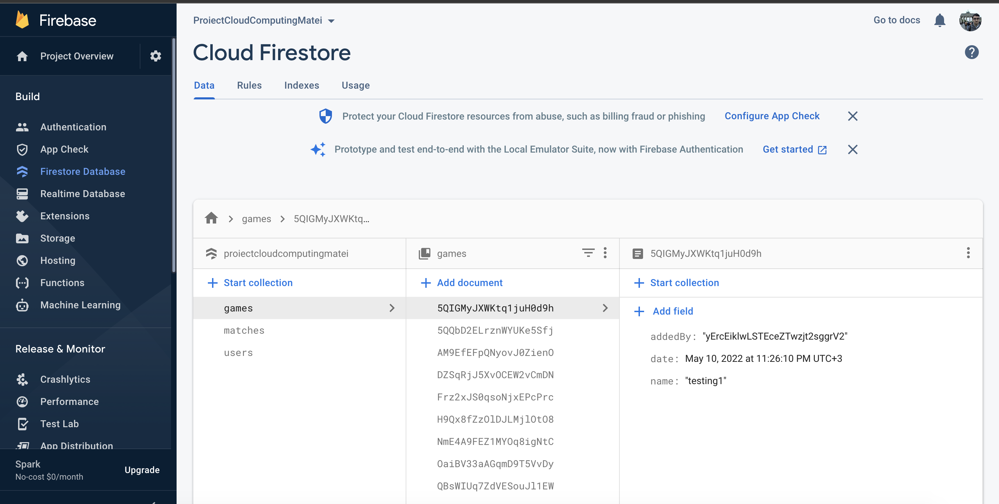
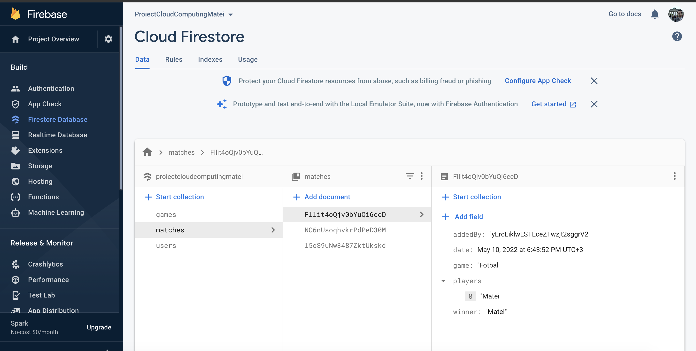
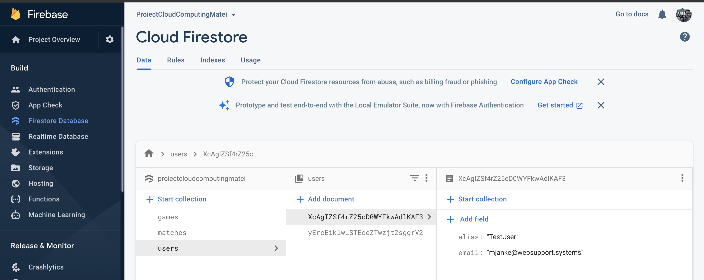
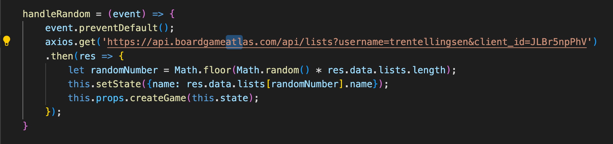
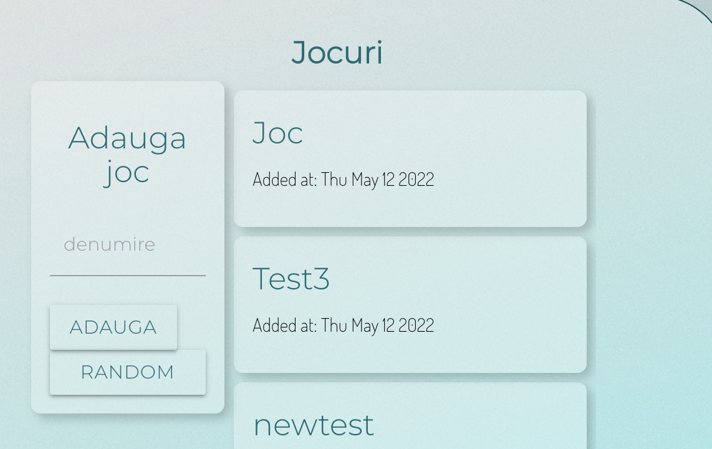
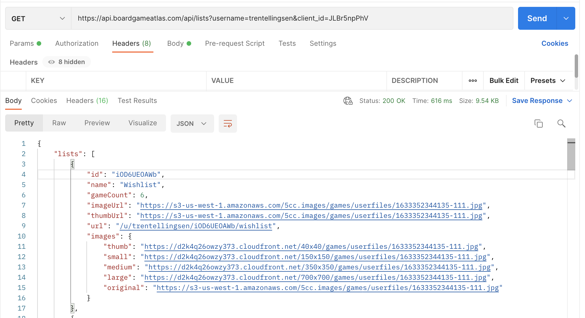
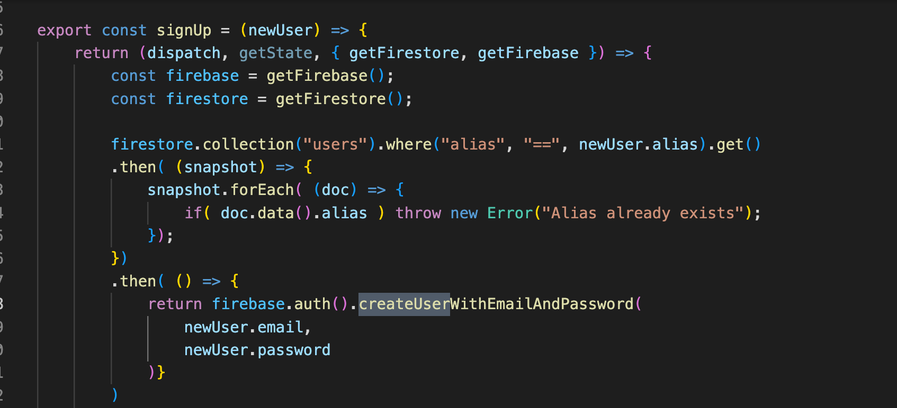
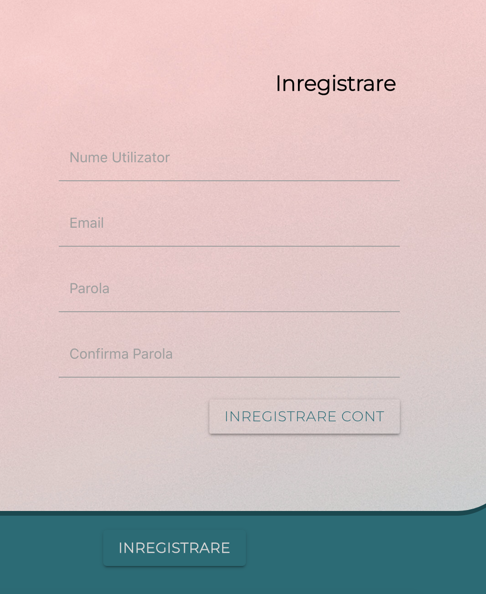
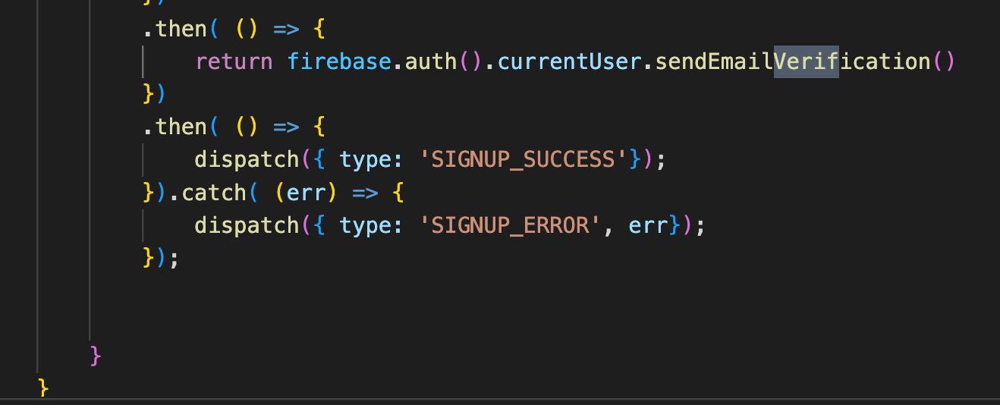

1) Introducere

"Video Games" este o aplicație realizată pentru cei ce joaca jocuri video competitve de tip 1 vs 1. Prin aceasta aplicatie am dorit sa pot sa adaug un joc, sa adaug un meci intre doi jucatori si sa determin castigatorul. Am adaugat si o sectiune de "Statistici Generale" si "Statistici personale" pentru a putea urmari evolutia jucatorilor in timp. 

2) Descrierea problemei

Aplicatia mea este una de tip Single-Page, pagina principala servind drept un portal pentru restul functiilor implementate. In primul rand am implementat partea de Back-end cu ajutorul NodeJS. Urmatorul pas a fost legarea aplicatiei de o baza de date. Am ales sa folosesc Firebase, mai exact o instanta de baza de date nerelationara: Firestore. Am ales aceasta varianta doarece doream sa folosesc Firebase si pentru implementarea unei facilitati de Inregistrare si Autentificare utilizator. Nu in ultimul rand am lucrat la partea de front-end a aplicatie folosind React si Redux. 

Dupa cum am mentionat deja, un utilizator se poate inregistra, va trebui sa confirme adresa de e-mail furnizata, dupa care se poate autentifica in aplicatie. Un utilizator care nu confirma adresa de e-mail nu se va putea autentifica.

3)	Descriere API

I) Firestore API:
•	Folosim firestore pentru a initializa, a ne conecta, a stoca date si a modifica datele stocate in baza de date. 
•	Folosim firestore.collection pentru a indica "colectia" in care vom stoca datele pe care le furnizam. Furnizam date despre utilizatori ("users"), meciuri ("matches") si jocuri ("games").

Spre exemplu in colectia users stocam date despre utilizatori. Aceste date se stocheaza dupa ce este completata functionalitatea de inregistrare. 

II)	Generarea unui joc random

Am definit functia handleRandom in cadrul Gameform.js pentru a putea face un request catre API furnizat de catre boardgameatlas.com. La apasarea butonului de Random vom face un request catre API, iar acesta ne va furniza o denumire de joc random. 
Pentru a putea accesa API-ul a fost necesar sa ma inregistrez pe platforma celor de la boardgameatlas, apoi sa astept pentru a-mi fi generat un client_id. Apoi am integrat aceasta functionalitate in aplicatie, urmand sa adaug si un buton pentru accesarea ei din interfata.

4)	Flux de date

Atunci cand trimitem un request de tip GET catre API-ul furnizat de catre boardgameatlas, vom primi inapoi urmatorii parametrii:
•	Id
•	name
•	gameCount
•	imageUrl
•	thumbUrl
•	url
•	images (aici se regasesc URL-uri in diverse dimensiuni)

In contextul aplicatiei noastre ne este necesar doar campul "name" pe care il vom prelua si il vom adauga in colectia din baza de date.

Am folosit Firebase atat pentru a implementa functionalitatea de autentificare, cat si pentru a crea, stoca si insera date intr-o baza de date nerelationala (Firestore).
Folosim datele din colectiile create pentru a facilita procesele de inregistrare, autentificare, adaugare de joc dar si pentru  a oferi statistici.

Mai jos putem urmari cum am facilitat procesul de inregistrare si verificare daca numele utilizatorului exista deja in baza de date.

De asemenea, asa cum am mentionat in descrierea aplicatiei este necesara parcurgerea procedurii de verificare a adresei de email furnizate pentru a putea accesa aplicatia.

5) Referinte proiect

Firebase:
https://firebase.google.com/docs/reference/js
BoardGameAtlas:
https://www.boardgameatlas.com/api/docs
Link catre GitHub personal:
https://github.com/MateiV/GamesCC
Link video:
https://youtu.be/_Tmxu0HHtqc
Link publicare:

